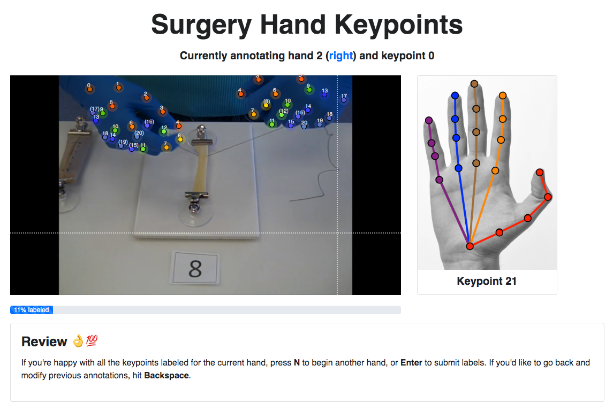
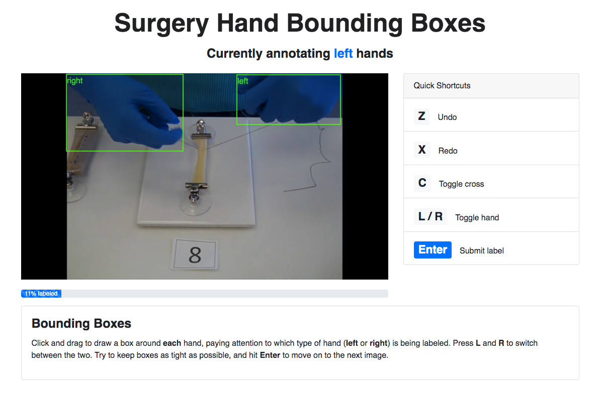

# Surgery Hands Labeling Tool

A minimal React app for bounding box and hand keypoint annotation of hands in surgical images.

<!-- |        Bounding Boxes        |            Keypoints             |
| :--------------------------: | :------------------------------: |
|  |  | -->

Socially obligated to say this: this project was bootstrapped with `create-react-app`. For more info, see the original project [here](https://github.com/facebook/create-react-app/blob/master/packages/react-scripts/template/README.md). Will gladly say that the initial version was forked from [turktool](https://github.com/jaxony/turktool).  

## Setup

> > :warning: **Heads Up**!  
> > The following was only tested on Macs.
The only requirements you need out of the box are Python (built with 3.6, but 2 also should work) and npm. You can install npm [here](https://www.npmjs.com/get-npm).      

After git cloning, install ~~all~~ most dependencies with: `cd surgery-hand-labels && npm install .`

- For a list of all dependencies, see `package.json`

We want to install one dependency globally: `json-server`. This will serve as a makeshift backend server. To do so, run `npm install -g json-server`

- If you get permission errors, do the following:
  - Create a directory for global installations: `mkdir ~/.npm-global`
  - Configure npm to use this new directory path: `npm config set prefix '~/.npm-global'`
  - In terminal, enter `PATH=~/.npm-global/bin:$PATH`, and you should be good to go.
  - Alternatively, to avoid possibly doing this multiple times:
    - Create a new file `~/.profile` and add this line: `export PATH=~/.npm-global/bin:$PATH`
    - Update system variables with `source ~/.profile`
  - Should be good to go.

## Actually starting things up

1. First, make sure you have data to label. Move any images to `./src/images`. They should be directly accessible from that path, e.g. not in another folder (also see example images. provided on GitHub). Once those are added, delete the example images or move them to another directory.
2. Next, prepare the data for annotation by running `python init_data.py`
3. Afterwards, set up the local server to load data with `json-server --watch src/data.json -p 3001`
4. Finally, in a separate terminal window, change directories to this project and run the actual software with `yarn start` or `npm start`

## Configuring bounding box or keypoint labeling

Besides the annotation mode, everything should be pre-configured to work out of the box. Bounding box labeling is enabled by default.

To switch to keypoints, in `/src/config.json`, simply change `"keypoints": false` to `"keypoints": true`.

|        Bounding Boxes        |            Keypoints             |
| :--------------------------: | :------------------------------: |
|  |  |

## Todos

Fundamentals:

- [x] Feed in images based on JSON file
- [x] Enable saving labels directly to local file
- [x] Implement bounding box labeling

Useful Features:

- [x] Implement hand keypoint labeling
- [x] Ergonomic key commands - _Needs testing though_

Nice to have:

- [x] Enable switching between images (for bounding box annotations)  
- [x] Display (bounding box) annotations on load (in keypoint mode)  
- [ ] Clear all labels key command
